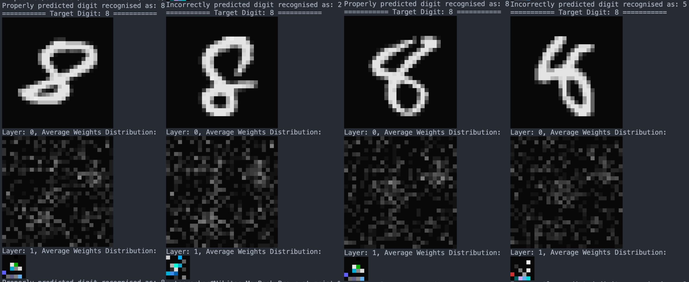

# rust-mnist

A small **feed-forward neural network** in Rust for MNIST digit classification. It implements backpropagation and mini-batch stochastic gradient descent (SGD) from scratch using the [ndarray](https://crates.io/crates/ndarray) crate, with optional terminal visualisation of activations and average weight maps. **The network layout is customisable** — you can use the default `[784, 36, 10]` or any other architecture (e.g. `[784, 64, 32, 10]`) by changing the shape passed to `Network::new()` in `main.rs`.

## Features

- **Architecture:** Customisable — default 784 → 36 → 10 (one hidden layer, sigmoid activations). Use any layout you like, e.g. `[784, 64, 32, 10]` for two hidden layers.
- **Training:** Mini-batch SGD; data shuffled each epoch
- **CLI:** Optional `--digit N` to visualise weight maps for a specific digit (0–9) after the last epoch

---

## Program flow at a glance

The program runs in three main stages:

1. **Load MNIST data** — Read training/test images from disk, normalize pixels to [0,1], one-hot encode labels. Build `Sample` pairs (image, label).
2. **Train the network** — For each epoch: shuffle data, split into mini-batches, run backprop + gradient update per batch. After each epoch, evaluate on the test set and print accuracy.
3. **Inference and visualisation** — On the final epoch, optionally print weight maps for a chosen digit (correct and incorrect examples). Prediction = argmax of the output layer.

Below, each stage is broken down with formulas and code references.

---

## Quick start

**Requirements:** Rust (e.g. [rustup](https://rustup.rs/)).

### MNIST data setup

**The repo already includes the MNIST data** — you do not need to download anything. The `data/` folder contains the standard MNIST files (gzip format) expected by the [mnist](https://crates.io/crates/mnist) crate:

- `train-images-idx3-ubyte.gz`
- `train-labels-idx1-ubyte.gz`
- `t10k-images-idx3-ubyte.gz`
- `t10k-labels-idx1-ubyte.gz`

Layout:

```
rust-mnist/
  data/
    train-images-idx3-ubyte.gz
    train-labels-idx1-ubyte.gz
    t10k-images-idx3-ubyte.gz
    t10k-labels-idx1-ubyte.gz
  src/
  Cargo.toml
  ...
```

If you ever need to re-download the dataset, the original files are from [yann.lecun.com/exdb/mnist/](http://yann.lecun.com/exdb/mnist/) (place the gzip files in `data/`; no need to gunzip).

### Build and run

```bash
cargo build
cargo run
```

Training runs for 30 epochs; test accuracy is printed after each. On the **final** epoch, weight visualisations are printed for a **random** digit unless you specify one:

```bash
# Visualise weight maps for digit 7
cargo run -- --digit 7

# Short form
cargo run -- -d 0
```

The `--` ensures `--digit` / `-d` are passed to your program, not to Cargo.

---

## Project structure and workflow

| Step                     | What happens                                                                                                 | Code                                                                                                     |
| ------------------------ | ------------------------------------------------------------------------------------------------------------ | -------------------------------------------------------------------------------------------------------- |
| **Data**           | Load MNIST, normalize pixels to [0,1], one-hot labels (e.g. digit 5 →`[0,0,0,0,0,1,0,0,0,0]`).            | `data_loader::MnistData::new()`, `Sample::new()`                                                     |
| **Build network**  | Create MLP with layer sizes and learning rate (shape is configurable in `main.rs`).                        | `Network::new(&[784, 36, 10], learning_rate)` — use e.g. `&[784, 64, 32, 10]` for two hidden layers |
| **One epoch**      | Shuffle data, split into mini-batches (size 32), run one gradient step per batch.                            | `run_training_epoch()` → `process_batch()`                                                          |
| **One batch step** | For each sample: forward → deltas → gradients; sum over batch; update weights/biases with step$-\eta/n$. | `process_batch()` → `backprop()` → `forward()`, `compute_deltas()`, `compute_gradients()`    |
| **Inference**      | Forward pass only; predicted digit = argmax of output layer.                                                 | `predict()`                                                                                            |
| **Visualisation**  | On final epoch: show average weight maps for a chosen digit (neurons with activation > 0.3).                 | `display_active_weights()`, `display_weights()`                                                      |

**Loss:** Mean squared error (MSE) over outputs: $C = \frac{1}{2} \sum_j (a_j^{(L)} - t_j)^2$.

**Update rule:** $w \leftarrow w - (\eta/n) \sum \nabla w$, $b \leftarrow b - (\eta/n) \sum \nabla b$, where $n$ is the batch size and the sum is over samples in the mini-batch.

---

## Detailed workflow by stage

### Stage 1: Loading MNIST data

Goal: turn the official MNIST train/test files into in-memory vectors the network can use (normalized pixels + one-hot labels).

1. Read the four files from `data/` via the `mnist` crate (train images/labels, test images/labels). → `MnistBuilder::new().base_path("data").finalize().normalize()`
2. Training: each image is 28×28 = 784 pixels. Process in chunks of 784; convert each pixel from 0..255 to 0.0..1.0. Labels are one-hot: digit $d$ → length-10 vector with 1 at index $d$. Store as `(pixels, one_hot)` pairs. → `data_loader.rs`: `MnistData::new()`, `trn_img.chunks(INPUT_PIXELS)`, `trn_lbl.chunks(ONE_HOT_OUTPUT_VECTOR_SIZE)`, `Sample::new()`
3. Test set: same pixel normalization; labels one-hot as well (we use `get_label_as_digit()` for evaluation). → same flow, `tst_img` / `tst_lbl`

**Entry point:** `MnistData::new()` in `data_loader.rs`; `main.rs` holds `training_data_set` and `test_data_set`.

---

### Stage 2: Training the network

Goal: adjust weights and biases so the 10 output activations match the one-hot targets. We use mini-batch SGD: for each batch, compute gradients per sample, average them, then one update.

#### 2.1 Build the network

- Architecture is **configurable** in `main.rs`. Default: `[784, 36, 10]` (784 inputs, 36 hidden, 10 outputs). You can use e.g. `[784, 64, 32, 10]` for two hidden layers. → `Network::new(&[data_loader::INPUT_PIXELS, 36, 10], 3.0)` (change the slice to alter the layout)
- Each layer: weight matrix of shape `(num_neurons, inputs)`, biases length `num_neurons`. Weights initialized uniformly in $[-1, 1)$, biases to 0. → `Layer::new(shape[i], shape[i+1])` in `Network::new()`

#### 2.2 One epoch

1. Shuffle the training set so mini-batches differ every epoch. → `main.rs`: `data.training_data_set.shuffle(&mut rng)`
2. Split into chunks of `MINI_BATCH_SIZE` (32). → `training_data_set.chunks(MINI_BATCH_SIZE)`
3. For each mini-batch: run `process_batch(batch)` (see below).
4. After the epoch: run the network on the test set, count correct predictions (predicted digit = argmax output, compare to label). → `test_nn_and_print_results()` in `main.rs`

#### 2.3 One mini-batch step (`process_batch`)

1. For **each sample** in the batch: call `backprop(sample)` → forward pass (cache activations $a$ and pre-activations $z$), compute deltas $\delta$ for all layers, then gradients $\partial C/\partial w$ and $\partial C/\partial b$.
2. **Accumulate** weight and bias gradients over all samples in the batch.
3. **Update:** $w \leftarrow w + \text{step} \cdot \nabla w$, $b \leftarrow b + \text{step} \cdot \nabla b$, with $\text{step} = -\eta/n$ (so we subtract the average gradient scaled by $\eta$). → `Layer::update_weights()`, `Layer::update_biases()`

#### 2.4 Backpropagation (per sample, `backprop`)

For one (input, target) pair:

1. **Forward:** Compute and store each layer’s output $a$ and pre-sigmoid sum $z$. → `forward(sample)` → returns `layers_activations` (input + per-layer outputs) and `layers_z`.
2. **Deltas:** Output layer $\delta^{(L)} = (a^{(L)} - t) \odot \sigma'(z^{(L)})$. Hidden layers (from last to first): $\delta^{(l)} = (W^{(l+1)})^\top \delta^{(l+1)} \odot \sigma'(z^{(l)})$. → `compute_deltas()`
3. **Gradients:** $\partial C/\partial b = \delta$, $\partial C/\partial w = \delta \otimes a_{\text{prev}}$ (outer product: $\delta$ as column, $a_{\text{prev}}$ as row). → `compute_gradients()`

**Entry point:** `main.rs`: loop over epochs, `run_training_epoch()` then `test_nn_and_print_results()`.

---

### Stage 3: Inference and visualisation

- **Prediction:** One forward pass; predicted digit = index of the maximum output. → `Network::predict(sample)` (uses `forward()` then argmax).
- **Weight visualisation (final epoch only):** For a chosen digit, find test samples with that label; for each layer, average the weight vectors of neurons with activation > 0.3, then render the average as a 2D grid in the terminal. → `display_active_weights()`, `print_neuron_weights()`, `display_weights()`.

**Entry point:** `test_nn_and_print_results()` calls `nn.predict(sample)` and, when appropriate, `nn.display_active_weights()`.

---

## Custom visualisation: activated weights aggregation

To better understand how the network learns, I developed a custom method to "see" what the model is looking at.



**How it works:**

1. **Thresholding:** During inference, I track neurons whose activation is **> 0.3** for each layer.
2. **Aggregation:** I sum the weight vectors of these active neurons.
3. **Normalization:** The result is averaged by the number of active neurons to produce a single composite image per layer.

This gives a view of the "internal prototypes" the network has learned for each digit. The visualisation helps explain both **properly predicted** cases (what the model focused on) and **incorrectly predicted** ones (e.g. why an 8 was confused with a 2 or 5).

**About this visualisation:** On the final epoch I show only **2 correct** and **2 incorrect** examples per chosen digit - enough to get a feel for what the network is doing, without turning this into an analysis tool. The goal here is to sanity-check that the "brain" structure works: we can see that active neurons and their averaged weights line up with the digit and with the kinds of mistakes the model makes.

**Colors:** Weight maps are drawn in the terminal with ANSI 256-color grayscale (dark → light) for values in the 0–1 range. Weights that have grown outside that range during training wrap into the color palette (e.g. red/green/blue for larger positive values), so stronger or out-of-range weights show up as colored pixels — a quick way to spot which parts of the input the layer is responding to most.

---

## Notation

- **$L$** — number of weight layers (here: 2; one hidden, one output).
- **$w_{jk}^{(l)}$** — weight from unit $k$ in layer $l-1$ to unit $j$ in layer $l$. In code: `layer.weights` has shape `(num_neurons, inputs)`, so row $j$, column $k$.
- **$b_j^{(l)}$** — bias of unit $j$ in layer $l$.
- **$z_j^{(l)}$** — pre-activation (weighted sum) of unit $j$ in layer $l$.
- **$a_j^{(l)}$** — activation (output) of unit $j$ in layer $l$; $a^{(0)}$ is the network input (784 pixels).
- **$\sigma(z)$** — Sigmoid: $\sigma(z) = \frac{1}{1 + e^{-z}}$.
- **$\sigma'(z)$** — Derivative: $\sigma'(z) = \sigma(z)(1 - \sigma(z))$.
- **$t$** — Target output (one-hot, length 10).
- **$\eta$** — Learning rate.

---

## Forward pass

For each layer $l = 1, \ldots, L$ we compute pre-activation and activation; both are stored for the backward pass.

**Pre-activation (weighted sum):**

$$
z_j^{(l)} = \sum_k w_{jk}^{(l)} a_k^{(l-1)} + b_j^{(l)}
$$

**Activation:**

$$
a_j^{(l)} = \sigma(z_j^{(l)})
$$

**In code:** `Network::forward()` in `network.rs`. Returns `layers_activations` (input plus one vector per layer) and `layers_z`. Single-layer step: `z = layer.weights.dot(&current_activations) + &layer.biases`, then `activations = z.mapv(Network::sigmoid)`.

---

## Backward pass (deltas)

We compute the error signal $\delta$ for each layer, from the output layer back to the first hidden layer.

**Output layer ($\delta^{(L)}$):**

$$
\delta_j^{(L)} = (a_j^{(L)} - t_j) \cdot \sigma'(z_j^{(L)})
$$

This is the gradient of the MSE loss with respect to $z_j^{(L)}$ (chain rule). $t_j$ is the one-hot target for output $j$.

**Hidden layers ($\delta^{(l)}$):**

$$
\delta_j^{(l)} = \left( \sum_k w_{kj}^{(l+1)} \delta_k^{(l+1)} \right) \cdot \sigma'(z_j^{(l)})
$$

So we backpropagate the deltas of layer $l+1$ through the weight matrix (transpose), then multiply by $\sigma'(z^{(l)})$.

**In code:** `Network::compute_deltas()` in `network.rs`. Takes `layers_activations`, `layers_z`, and the target; returns a `Vec<Array1<f32>>` of deltas (one per layer).

---

## Gradients

From the cached $a$ and the computed $\delta$:

**Bias gradient:**

$$
\frac{\partial C}{\partial b_j^{(l)}} = \delta_j^{(l)}
$$

**Weight gradient (outer product):**

$$
\frac{\partial C}{\partial w_{jk}^{(l)}} = \delta_j^{(l)} \cdot a_k^{(l-1)}
$$

So for the whole layer, $\nabla w^{(l)} = \delta^{(l)} \otimes (a^{(l-1)})^\top$ (column $\delta$ times row $a^{(l-1)}$), giving a matrix of shape `(num_neurons, inputs)`.

**In code:** `Network::compute_gradients()` in `network.rs`. Reshapes $\delta$ to a column and $a^{(l-1)}$ to a row, then uses dot product to form the gradient matrix.

---

## Full training step (per sample and per batch)

1. **Forward:** Compute and store all $z$ and $a$ → `forward()`.
2. **Deltas:** Compute $\delta$ for every layer → `compute_deltas()`.
3. **Gradients:** Compute $\partial C/\partial w$ and $\partial C/\partial b$ → `compute_gradients()`.
4. **Batch:** Sum gradients over all samples in the mini-batch, then update:
   $$
   w \leftarrow w - \frac{\eta}{n} \sum \nabla w, \qquad
   b \leftarrow b - \frac{\eta}{n} \sum \nabla b
   $$

   with $n$ = batch size. In code: negative step $-\eta/n$ is passed to `update_weights` / `update_biases` (which do `scaled_add(step, grad)`), so we subtract the average gradient.

**In code:** `backprop()` does steps 1–3. `process_batch()` loops over the batch, calls `backprop()` for each sample, accumulates gradients, then applies the update with step $-\eta/n$.

---

## Summary table

| Theory                                                                                   | Code                                          |
| ---------------------------------------------------------------------------------------- | --------------------------------------------- |
| Forward:$z^{(l)} = W^{(l)} a^{(l-1)} + b^{(l)}$, $a^{(l)} = \sigma(z^{(l)})$         | `forward()`                                 |
| Output delta:$\delta^{(L)} = (a^{(L)} - t) \odot \sigma'(z^{(L)})$                     | `compute_deltas()` (last layer)             |
| Hidden delta:$\delta^{(l)} = (W^{(l+1)})^\top \delta^{(l+1)} \odot \sigma'(z^{(l)})$   | `compute_deltas()` (reverse loop)           |
| $\partial C/\partial b = \delta$, $\partial C/\partial w = \delta \otimes a^{(l-1)}$ | `compute_gradients()`                       |
| Mini-batch SGD: average gradients, then$w \leftarrow w - (\eta/n)\sum \nabla w$        | `process_batch()`, `run_training_epoch()` |
| Prediction = argmax of output layer                                                      | `predict()`                                 |

---

## Code map

- **MNIST loading** — `data_loader.rs`: `MnistData::new()`, `Sample::new()`
- **Network build & training** — `network.rs`: `Network::new()`, `Layer::new()`, `run_training_epoch()`, `process_batch()`, `backprop()`, `forward()`, `compute_deltas()`, `compute_gradients()`, `Layer::update_weights()`, `Layer::update_biases()`
- **Sigmoid** — `network.rs`: `sigmoid()`, `sigmoid_derivative()`
- **Inference & main flow** — `main.rs`: `main()`, `test_nn_and_print_results()`, `parse_digit_arg()`; calls into `data_loader` and `Network`
- **Visualisation** — `network.rs`: `display_active_weights()`, `print_neuron_weights()`, `display_weights()`, `infer_grid_shape()`; `sample.rs`: `display_digit()`

---

## Licence

This project is licensed under the MIT License (see [LICENSE](LICENSE)), with an additional restriction that it does not grant the right to use the software or its contents for training ML/AI systems without separate permission.
